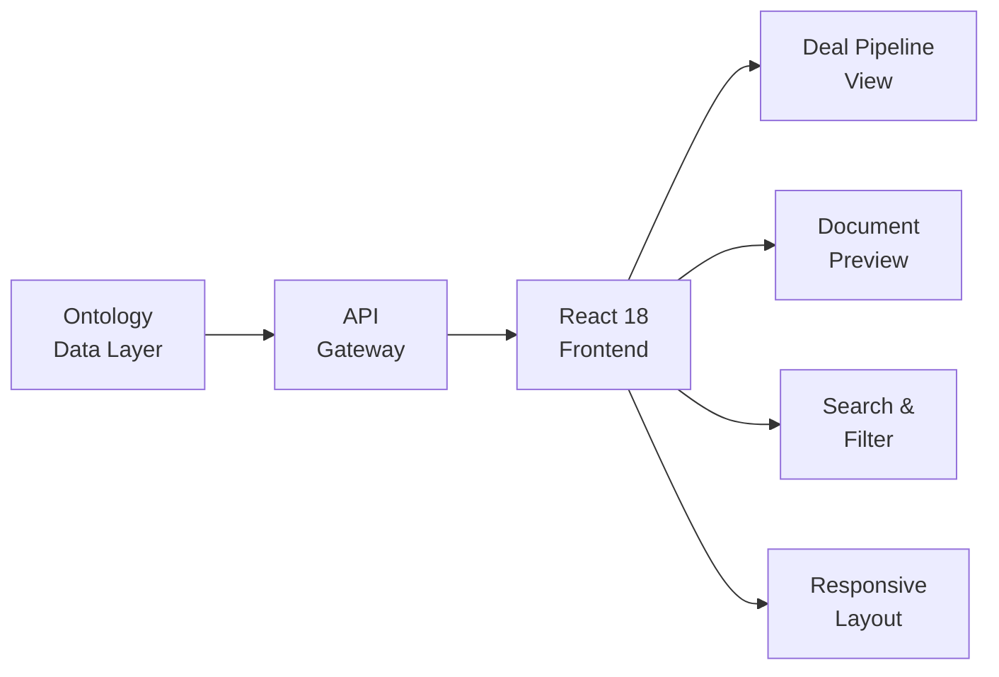

## Overview

Managing a pipeline of corporate credit deals requires tracking documents, status changes, and key metrics across dozens of active opportunities. This platform provides a unified interface for deal management with document preview, multi-criteria search, and a structured data layer that keeps deal information organized and accessible.

## Technical Approach

**Deal Pipeline View**: Deals are organized by stage (screening, analysis, negotiation, closed) with card-based views showing key metrics at a glance. Drag-and-drop or status updates move deals through the pipeline.

**Document Preview**: Integrated PDF viewer allows analysts to review deal documents without leaving the platform. Documents are linked to deals and organized by type (term sheet, financial statements, legal documents).

**Multi-Criteria Search**: Full-text search combined with structured filters (sector, rating, size, stage) enables quick discovery of deals matching specific criteria. Saved filters support recurring queries.

**Responsive Design**: The interface adapts to different screen sizes, supporting use on large monitors for detailed analysis and laptops for quick lookups.

## Key Results

- Centralizes deal tracking for the full lifecycle from screening to close
- Inline PDF preview eliminates context-switching between applications
- Multi-criteria search finds relevant deals in seconds
- Responsive design supports desktop and laptop workflows

## Technologies Used

`React 18` `TypeScript` `Tailwind CSS` `Material-UI`
