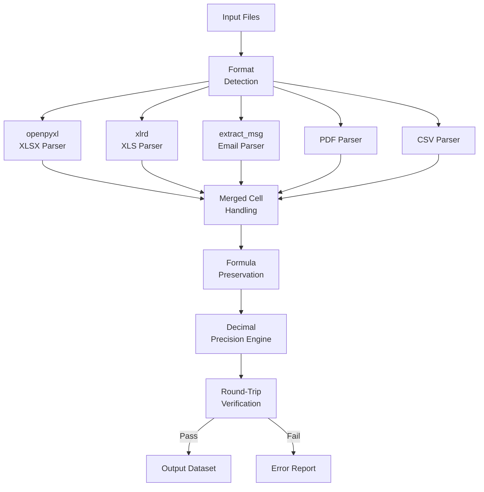

## Overview

Financial data arrives in every imaginable format — Excel workbooks with merged cells and formulas, PDFs with embedded tables, CSV files with mixed encodings, and email attachments buried in MSG files. This extraction engine handles all of them with a unified interface and guarantees lossless data fidelity through round-trip verification.

## Technical Approach

**Format Detection**: File type is determined by magic bytes and extension, then routed to the appropriate parser. Each parser is optimized for its format's specific challenges.

**Merged Cell Handling**: Excel merged cells are detected and values are propagated correctly to all constituent cells. This is critical for financial reports where headers span multiple columns.

**Formula Preservation**: Excel formulas are tracked alongside computed values. When formulas reference external workbooks, the last-computed value is preserved with a notation.

**Decimal Precision Engine**: All numeric values are handled using Python's `Decimal` type to avoid floating-point artifacts. The extraction guarantees precision to <1e-10, which is essential for financial calculations where rounding errors compound.

**Round-Trip Verification**: After extraction, the data is written back to the source format and compared cell-by-cell. Any discrepancy triggers a detailed error report identifying the exact cells that differ.

## Key Results

- Handles 5+ file formats through a single unified interface
- Decimal precision <1e-10 verified through round-trip testing
- Merged cell handling correctly propagates values in complex financial reports
- Formula preservation maintains audit trail for computed values
- Email parser extracts attachments from nested MSG/EML files

## Technologies Used

`Python` `openpyxl` `xlrd` `extract_msg` `Decimal` `gzip`
