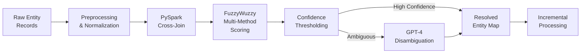

## Overview

Financial datasets often contain the same entity represented in dozens of different ways — abbreviations, misspellings, legal suffixes, and regional naming conventions all create duplicates that compromise downstream analytics. This project built an end-to-end entity resolution pipeline that deduplicates entity names across millions of records using a combination of traditional NLP techniques and LLM-powered disambiguation.

## Technical Approach

The system operates in a multi-stage pipeline, progressively filtering and scoring candidate matches:

**Stage 1 — Preprocessing & Normalization**: Strip legal suffixes (LLC, Inc., Ltd.), normalize whitespace and casing, expand common abbreviations, and generate blocking keys to reduce the comparison space.

**Stage 2 — Distributed Cross-Join**: PySpark distributes the pairwise comparison workload across the cluster. Blocking keys reduce the O(n^2) comparison space to manageable partitions.

**Stage 3 — Multi-Method Fuzzy Scoring**: Each candidate pair is scored using multiple FuzzyWuzzy methods (ratio, partial_ratio, token_sort_ratio, token_set_ratio). The ensemble score provides robustness against different types of name variations.

**Stage 4 — LLM Disambiguation**: Pairs that fall in the ambiguous confidence range are sent to GPT-4 with structured prompts that include entity context (sector, geography, relationships) for final resolution.

**Stage 5 — Incremental Processing**: New records are matched against the existing resolved entity map without reprocessing the entire dataset.

## Key Results

- Deduplicated 5M+ financial entity records with >95% precision
- Reduced manual review queue by 80% through confidence-based routing
- Incremental processing handles daily updates in minutes rather than hours
- Multi-method scoring catches variations that single-method approaches miss

## Technologies Used

`Python` `PySpark` `FuzzyWuzzy` `GPT-4 API` `NLP` `Distributed Computing`
