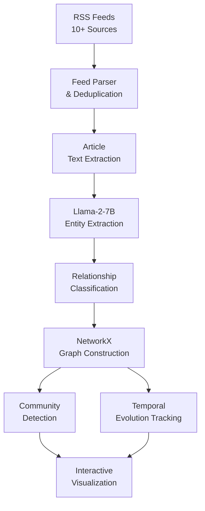

## Overview

Staying on top of financial news requires understanding not just individual articles, but the web of relationships between entities — companies, people, deals, and sectors. This project builds a continuously-updating knowledge graph by crawling financial news RSS feeds, extracting entities and relationships using a locally-hosted LLM, and visualizing the evolving network.

## Technical Approach

**RSS Crawling & Deduplication**: A scheduler polls 10+ financial news RSS feeds at configurable intervals. Articles are deduplicated by URL hash and content similarity to avoid redundant processing.

**LLM Entity Extraction**: Each article is passed through Llama-2-7B with structured prompts that extract named entities (organizations, people, financial instruments) and classify relationships (acquisition, partnership, litigation, leadership change).

**Graph Construction**: Extracted entities become nodes and relationships become edges in a NetworkX graph. Edge weights accumulate with repeated mentions, and temporal metadata tracks when relationships first appear and how they evolve.

**Community Detection**: Graph algorithms identify clusters of closely-related entities, revealing industry groupings, deal networks, and influence patterns that may not be obvious from individual articles.

## Key Results

- Processes 500+ articles/day from 10+ financial news sources
- Extracts entities with ~85% precision using local Llama-2-7B inference
- Community detection surfaces emerging sector trends before they become mainstream
- Temporal tracking shows relationship evolution over weeks and months

## Technologies Used

`Python` `Llama-2-7B` `NetworkX` `NLP` `RSS` `Knowledge Graphs`
