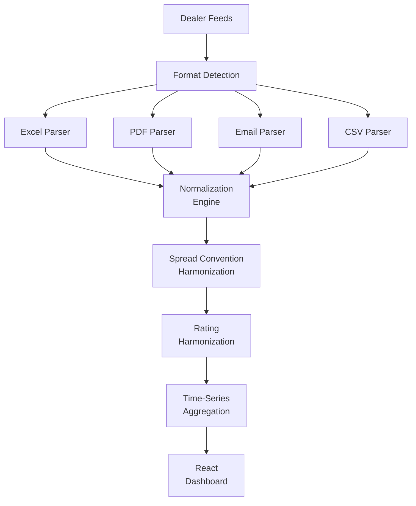

## Overview

Trading desks receive market data from multiple dealers in inconsistent formats — Excel spreadsheets, PDFs, emails, and CSV files with different column layouts, spread conventions, and rating scales. This platform centralizes ingestion, normalizes the data, and presents a unified view that eliminates hours of manual data preparation.

## Technical Approach

**Multi-Format Ingestion**: The platform automatically detects incoming file formats and routes them to specialized parsers. Each parser handles format-specific challenges — merged cells in Excel, table extraction from PDFs, attachment handling from emails.

**Normalization Engine**: Dealer-specific column mappings, spread conventions (OAS, DM, Z-spread), and rating scales (Moody's, S&P, Fitch) are harmonized to a common schema. Configurable mapping files allow quick onboarding of new dealers.

**Time-Series Aggregation**: Historical data points are aligned to a common timeline, enabling cross-dealer comparison and trend analysis. Analysts can track how dealer pricing evolves over time for specific securities.

## Key Results

- Ingests data from 8+ dealer feeds across 4 file formats
- Reduces analyst data preparation time by approximately 50%
- Harmonizes 3 rating scales and multiple spread conventions automatically
- Historical time-series enables cross-dealer pricing comparison

## Technologies Used

`Python` `React` `PySpark` `openpyxl` `Material-UI`
