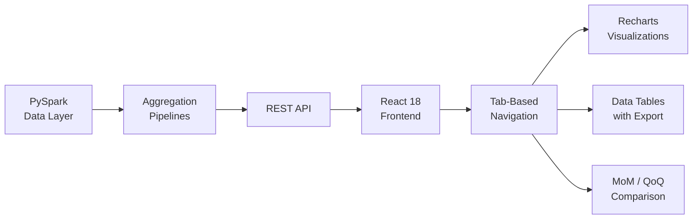

## Overview

Portfolio managers analyzing structured credit products need to slice data across multiple dimensions — by deal, sector, rating, vintage, and more. This dashboard provides 19+ analytical views with drill-down capability, enabling analysts to move from portfolio-level summaries to individual position details in a few clicks.

## Technical Approach

**Data Layer**: PySpark pipelines compute weighted aggregations across portfolio positions. Metrics include weighted average spread, rating distribution, sector concentration, and vintage analysis. Pre-computed snapshots enable fast month-over-month comparisons.

**Tab-Based Architecture**: The React frontend organizes 19+ views into a tabbed interface. Each tab represents a different analytical lens — portfolio summary, sector breakdown, rating migration, deal-level detail, and more.

**Drill-Down Navigation**: Clicking on a chart segment or table row navigates to a filtered detail view. Breadcrumb navigation tracks the drill-down path and allows quick backtracking.

**Export & Reporting**: Any view can be exported to CSV for further analysis in Excel. Pre-configured report templates combine multiple views into standardized outputs for portfolio reviews.

## Key Results

- 19+ analytical views covering all major structured credit product types
- Sub-second response times for portfolio-level aggregations
- Drill-down from portfolio summary to individual positions in 2-3 clicks
- Month-over-month comparison highlights changes in portfolio composition
- CSV export enables seamless integration with existing Excel workflows

## Technologies Used

`React 18` `TypeScript` `PySpark` `Recharts` `Tailwind CSS`
