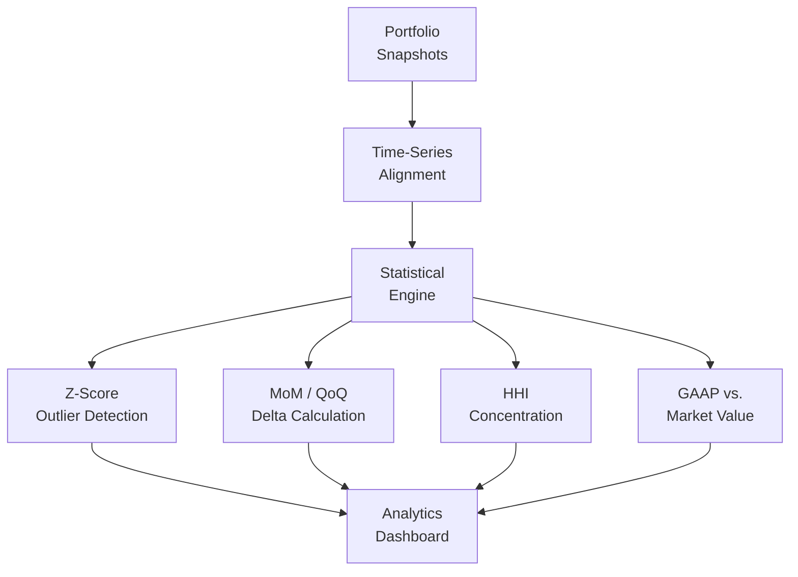

## Overview

Analyzing CLO (Collateralized Loan Obligation) portfolios requires statistical rigor — identifying outliers, tracking changes over time, measuring concentration risk, and comparing accounting values against market prices. This analytics engine provides a library of functions that power dashboards and reports with consistent, well-tested calculations.

## Technical Approach

**Snapshot-Based Time-Series**: Portfolio data is captured as point-in-time snapshots. The engine aligns snapshots to consistent dates and computes deltas at configurable frequencies (month-over-month, quarter-over-quarter).

**Statistical Outlier Detection**: Z-score analysis (>2-sigma threshold) identifies positions that deviate significantly from portfolio norms on key metrics — spread, price, rating, and size. Outliers are flagged for analyst review.

**Portfolio Concentration (HHI)**: The Herfindahl-Hirschman Index is computed across multiple dimensions (sector, issuer, rating) to quantify concentration risk. Trend analysis shows whether concentration is increasing or decreasing.

**GAAP vs. Market Value Comparison**: Side-by-side comparison of accounting values (amortized cost, par) against market prices highlights unrealized gains/losses and potential impairment candidates.

**Dealer Activity Analysis**: Tracks which dealers are actively quoting specific sectors and how their pricing compares, providing market color for trading decisions.

## Key Results

- Z-score detection surfaces anomalous positions before they become problems
- MoM/QoQ deltas quantify portfolio evolution over time
- HHI concentration metrics meet regulatory reporting requirements
- GAAP vs. market comparison identifies impairment candidates early
- Consistent calculation library eliminates spreadsheet discrepancies

## Technologies Used

`TypeScript` `Statistical Analysis` `Z-score` `Portfolio Analytics`
