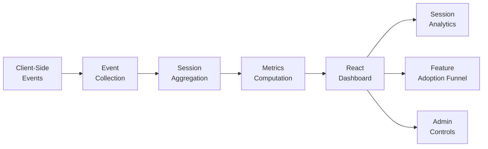

## Overview

Understanding how internal tools are used drives better product decisions — which features are adopted, where users spend their time, and which workflows are abandoned. This dashboard tracks session-level analytics across internal applications and presents actionable metrics through an admin interface.

## Technical Approach

**Event Collection**: Lightweight client-side instrumentation captures page visits, tab changes, button clicks, and time-on-page. Events are batched and sent asynchronously to avoid impacting application performance.

**Session Aggregation**: Raw events are grouped into sessions with computed metrics — total duration, pages visited, features used, and navigation patterns. Session boundaries are detected using configurable inactivity thresholds.

**Feature Adoption Funnel**: For key workflows, the dashboard tracks how many users start, progress through, and complete each step. Drop-off points are highlighted to identify UX friction.

**Admin Controls**: Administrators can view per-user analytics, configure tracking parameters, and export raw data for further analysis. Role-based access controls protect sensitive usage data.

## Key Results

- Tracks session-level metrics across internal applications
- Feature adoption funnels identify UX improvements that increase completion rates
- Time-on-page analysis reveals which views provide the most value
- Admin tools enable self-service analytics for product managers
- Lightweight instrumentation adds <5ms overhead per page load

## Technologies Used

`React 18` `TypeScript` `MUI X-Charts` `Analytics`
